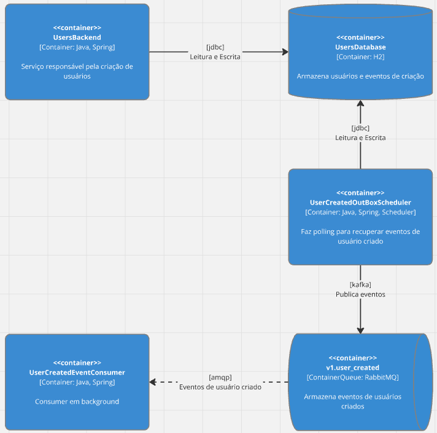

# Transaction OutBox

Padrão arquitetural utilizado para transacionar escritas em sistemas distribuidos

## Problema da Escrita Dupla

Como garantir a escrita em dois ou mais serviços, de forma resiliente, e que se comunicam via rede?
 Como garantir consistência e tolerância a partições (CP) ao escrever em múltiplos serviços?

## Exemplo

Como garantir a entrega do email de boas vindas ao usuário após o seu cadastro?
 O que acontece se em um **fluxo síncrono** de processamento o envio do email não
for possível devido a uma **partição na rede**?
 O que acontece se em um **fluxo síncrono** de processamento o envio do evento de
usuário criado para a fila/tópico não for possível devido a uma **partição na rede**?

## Solução

Transacionar o cadastro do usuário e o evento de criação do usuário em um único serviço.
Após isso, prosseguir com fluxo de envio de email de forma **assíncrona**

## Arquitetura

## Detalhes Importantes

Como o modelo de entrega de mensagens do padrão é **at-least-one**, pelo menos uma vez, é necessário
que o consumer do evento seja **idempotente** para evitar processamento duplicado.
